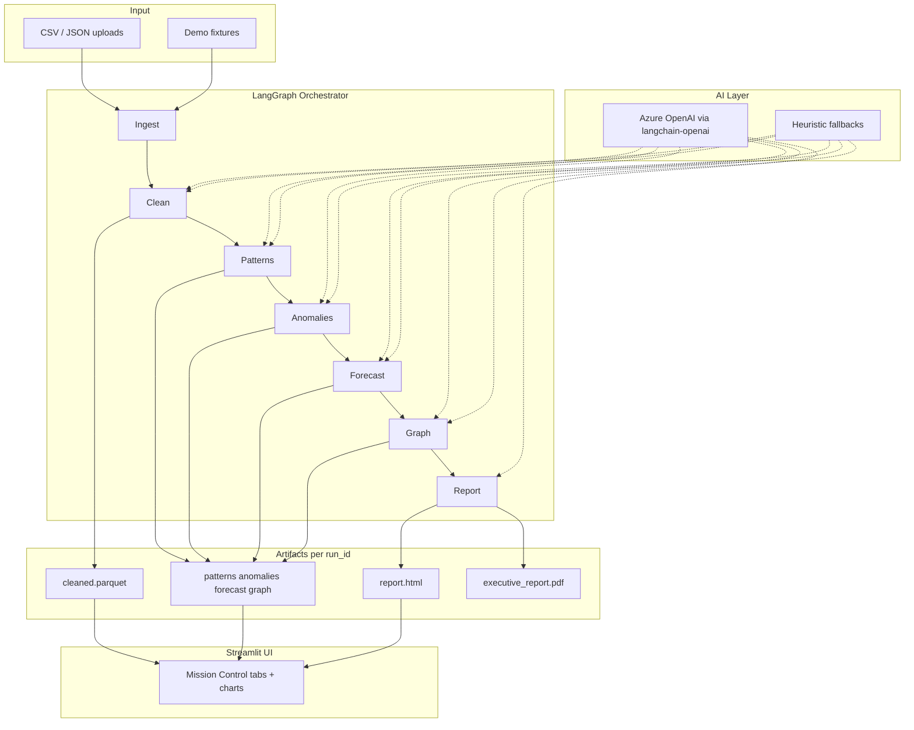

# Noise to Insight

**AI Meets Data: From Noise to Insight** — Microsoft Build 2026 Hackathon

[](https://www.python.org/downloads/)
[](LICENSE)

> Turn raw, messy operational data into executive-ready intelligence — cleaning, patterns, anomalies, forecasting, knowledge graphs, and reports in one agentic pipeline.

**Team:** Agentic Insights · **Contributor:** Shiraptinath C R · **Type:** Solo Product Builder

---

## Table of contents

1. [Project description](#project-description)
2. [What makes someone say “wow”](#what-makes-someone-say-wow)
3. [Architecture overview](#architecture-overview)
4. [AI tools used](#ai-tools-used)
5. [Dependencies](#dependencies)
6. [Setup instructions](#setup-instructions)
7. [Running the pipeline](#running-the-pipeline)
8. [Streamlit demo](#streamlit-demo)
9. [Project layout](#project-layout)
10. [Testing](#testing)
11. [Submission assets](#submission-assets)
12. [Team](#team)
13. [License](#license)

---

## Project description

Organizations drown in **noisy data**: HR exports with inconsistent column names, order files without dates, JSON dumps with missing fields, and spreadsheets that hide critical relationships. Manual cleaning and one-off dashboards take days; the signal stays buried.

**Noise to Insight** is an AI-first analytics pipeline that ingests messy CSV/JSON files and runs **six automated phases** to produce actionable output:

| Phase | What it does | Key output |
|-------|----------------|------------|
| **0 — Ingest & profile** | Load files, detect schema, null rates, dtypes | `profile.json` |
| **1 — Data cleaning** | LLM/heuristic cleaning plan + Polars execution | `cleaned.parquet` |
| **2 — Pattern discovery** | Correlations, segment lift, ranked insights | `patterns.json` |
| **3 — Anomaly detection** | Isolation Forest + LLM explanations | `anomalies.json` |
| **4 — Predictive analytics** | Prophet/sklearn forecast *or* snapshot bars for HR data | `forecast.json`, `forecast.png` |
| **5 — Knowledge graph** | Entity co-occurrence + optional LLM extraction | `graph.json`, `graph.html`, `graph.png` |
| **6 — Executive report** | Jinja HTML + optional WeasyPrint PDF | `report.html`, `executive_report.pdf` |

A **LangGraph** orchestrator wires all phases with per-run artifacts under `data/artifacts/<run_id>/`. A **Streamlit Mission Control** UI exposes each phase in dedicated tabs with KPIs, charts, graph diagrams, and downloads.

The pipeline works **with or without Azure OpenAI**: statistical methods always run; the LLM enriches cleaning plans, insight ranking, anomaly narratives, forecast text, graph extraction, and executive summaries when API keys are configured.

---

## What makes someone say “wow”

Example on the public **HR Employee Attrition** dataset (1,470 rows):

- **Headline insight:** JobLevel ↔ MonthlyIncome correlation **r ≈ 0.95** — compensation structure is tightly tied to level.
- **Anomalies:** Multivariate outliers flagged by employee ID with hypotheses and recommended actions.
- **Forecast (snapshot):** Average monthly income by department when no date column exists.
- **Knowledge graph:** How departments, roles, attrition, and satisfaction factors connect.
- **Executive report:** One HTML/PDF artifact leadership can read without opening code.

---

## Architecture overview



### Data flow

1. **Ingest** — `src/ingest/loader.py` loads CSV/JSON; `profiler.py` writes column-level stats.
2. **Clean** — `src/phases/cleaning.py` normalizes names, imputes, validates; outputs Parquet.
3. **Patterns** — `src/phases/patterns.py` computes correlations and segment lifts; ranks insight cards.
4. **Anomalies** — `src/phases/anomalies.py` runs Isolation Forest; links entities to graph IDs.
5. **Forecast** — `src/phases/forecast.py` detects time columns; uses Prophet with sklearn fallback, or snapshot analytics for tabular HR-style data.
6. **Graph** — `src/phases/graph_build.py` + `src/viz/graph_viz.py` build NetworkX/PyVis/Matplotlib views.
7. **Report** — `src/phases/report.py` renders Jinja templates; optional PDF via WeasyPrint.

Orchestration: `src/orchestrator/graph.py` · State models: `src/models/` · LLM client: `src/llm/client.py`

---

## AI tools used

| Tool | Role in this project |
|------|----------------------|
| **Azure OpenAI** (GPT-4o class deployment) | Structured outputs for cleaning plans, insight ranking, anomaly explanations, forecast narratives, graph entity extraction, executive summary |
| **LangChain OpenAI** | Azure-compatible chat client wrapper |
| **LangGraph** | Stateful six-phase pipeline with phase logging and error routing |
| **OpenAI Python SDK** | Structured parsing (`response_format`) for Pydantic models |
| **scikit-learn** | Isolation Forest anomaly detection; linear regression forecast fallback |
| **Prophet** | Time-series forecasting when date columns exist |
| **Polars** | Fast DataFrame cleaning and analytics |
| **NetworkX + PyVis** | Knowledge graph construction and interactive HTML |
| **Streamlit** | Mission Control demo UI |
| **Jinja2 + WeasyPrint** | Executive HTML/PDF reports |

When Azure OpenAI is not configured, every phase falls back to deterministic heuristics and statistical methods so the demo still runs end-to-end.

---

## Dependencies

### System requirements

- **Python 3.11+** (3.11 recommended)
- **macOS/Linux** (Windows supported with path adjustments)
- **Optional PDF:** `brew install pango gdk-pixbuf libffi` (macOS) for WeasyPrint

### Python packages (`pyproject.toml`)

| Package | Purpose |
|---------|---------|
| `polars` | Data loading, cleaning, analytics |
| `duckdb` | SQL analytics (optional queries) |
| `pydantic` | Typed pipeline state and artifact models |
| `langgraph` | Pipeline orchestration |
| `langchain-openai` | Azure OpenAI integration |
| `openai` | LLM API |
| `streamlit` | Demo UI |
| `scikit-learn` | Anomaly detection, forecast fallback |
| `prophet` | Time-series forecasting |
| `networkx`, `pyvis` | Knowledge graph |
| `matplotlib` | Forecast and graph charts |
| `jinja2`, `weasyprint` | Executive report |
| `python-dotenv` | Environment configuration |

**Dev:** `pytest`, `ruff`

### Install

```bash
git clone https://github.com/Shirapti-nath/noise-to-insight.git
cd noise-to-insight
python3.11 -m venv .venv
source .venv/bin/activate          # Windows: .venv\Scripts\activate
pip install -e ".[dev]"
```

---

## Setup instructions

### 1. Clone and install

```bash
git clone https://github.com/Shirapti-nath/noise-to-insight.git
cd noise-to-insight
python3.11 -m venv .venv
source .venv/bin/activate
pip install -e ".[dev]"
```

### 2. Environment variables (optional — for LLM enrichment)

```bash
cp .env.example .env
```

| Variable | Description |
|----------|-------------|
| `AZURE_OPENAI_ENDPOINT` | Azure OpenAI resource URL |
| `AZURE_OPENAI_API_KEY` | API key |
| `AZURE_OPENAI_DEPLOYMENT` | Deployment name (e.g. `gpt-4o`) |

### 3. Verify installation

```bash
pytest tests/ -q
```

Expected: all tests pass (67+).

### 4. Optional — PDF system libraries (macOS)

```bash
brew install pango gdk-pixbuf libffi
```

HTML reports work without this; PDF requires WeasyPrint system deps.

---

## Running the pipeline

### CLI — no LLM (fast, fully local)

```bash
python -m src.cli \
  --input tests/fixtures/segment_orders.csv \
  --run-id demo_run \
  --no-llm
```

### CLI — with Azure OpenAI

```bash
python -m src.cli \
  --input path/to/your_data.csv \
  --run-id my_run
```

### Demo script

```bash
chmod +x scripts/run_demo.sh
./scripts/run_demo.sh tests/fixtures/segment_orders.csv demo
```

### HR dataset example

```bash
python -m src.cli \
  --input path/to/WA_Fn-UseC_-HR-Employee-Attrition.csv \
  --run-id hr_run \
  --no-llm
```

Artifacts are written to `data/artifacts/<run_id>/`.

---

## Streamlit demo

Run from the **project root** (not from `app/`):

```bash
./scripts/run_streamlit.sh
# or
streamlit run app/streamlit_app.py
```

In the UI:

1. Choose **Upload files**, **Demo bundle**, or **Replay golden run**
2. Click **Run full pipeline**
3. Explore tabs: Overview · Ingest · Clean · Patterns · Anomalies · Forecast · Graph · Report
4. Use **Refresh charts** in the sidebar if visuals need rebuilding

**Troubleshooting:** If you see `ModuleNotFoundError: No module named 'src'`, activate the venv and run `pip install -e ".[dev]"` from the project root.

---

## Project layout

```
noise-to-insight/
├── app/
│   └── streamlit_app.py       # Mission Control UI
├── data/
│   └── artifacts/             # Per-run outputs (gitignored)
├── scripts/
│   ├── run_streamlit.sh
│   ├── run_demo.sh
│   └── generate_deck.py       # Hackathon PDF deck
├── src/
│   ├── cli.py                 # CLI entry point
│   ├── config.py
│   ├── ingest/                # Load + profile
│   ├── llm/                   # Azure OpenAI client
│   ├── models/                # Pydantic state models
│   ├── orchestrator/          # LangGraph pipeline
│   ├── phases/                # Six pipeline phases
│   └── viz/                   # Graph + refresh helpers
├── templates/
│   └── report.html            # Executive report template
├── tests/                     # pytest suite
├── tests/fixtures/            # Sample CSVs for demo
├── AgenticInsights_Deck.pdf   # Submission deck
├── pyproject.toml
└── README.md
```

---

## Testing

```bash
pytest tests/ -q
pytest tests/test_anomalies.py tests/test_forecast.py tests/test_graph.py -v
```

Coverage includes ingest, cleaning, patterns, anomalies, forecast, graph, report, orchestrator, and imports.

---

## Submission assets

| Asset | Location |
|-------|----------|
| **Project deck (PDF)** | `AgenticInsights_Deck.pdf` |
| **Regenerate deck** | `python scripts/generate_deck.py` |
| **Live demo** | Streamlit Mission Control |
| **Sample data** | `tests/fixtures/` |

---

## Team

| Field | Details |
|-------|---------|
| **Team name** | Agentic Insights |
| **Contributor** | Shiraptinath C R |
| **Type** | Solo Product Builder |
| **Role** | Product design, architecture, full-stack implementation (pipeline, AI integration, UI, testing, documentation) |

---

## License

MIT — Microsoft Build 2026 hackathon submission.
